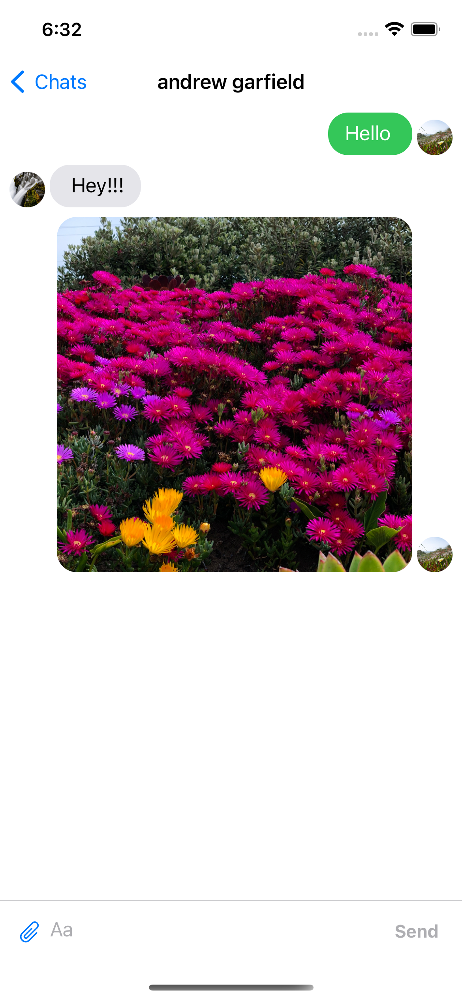

# BenyamChat - Chat App
BenyamChat is a simple chat application, where users can exchange messages and media files.

# Used technologies:
* Swift (UIKit)
* Firebase (used for handling real-time database);
* MessageKit (used for displaying messaged);
* GoogleSignIn (supports logging in with google account);
* JGProgressHUD (used as activity indicator);
* SDWebImage (used for caching images from backend).

# Features

#### Registration
* Log in to account
* Support for logging in with google account
* User Registration
* Choose a profile image

#### Users
* Search for registered friends to start conversation
* Send message to selected chat/friend
* View their profile
* Delete chat with particular user

#### Messages
* Support for text messages
* Support for sending a photo
* Support for sending a location
* Support for sending a video files

#### Video/Photo
* Take/Shoot a photo/video
* Choose from Library

# App Screens:

### Main

### Registration

  
  

### Chat

  
  
  

### Media files

  
  
  

